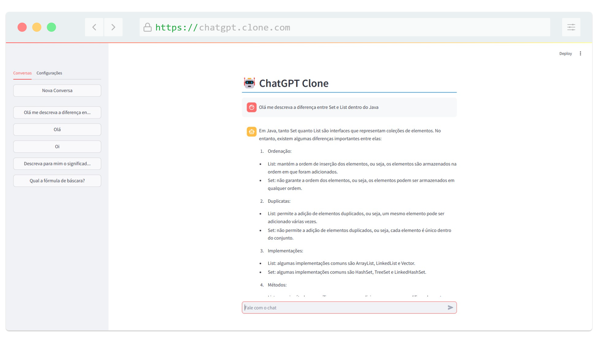

<h1 align="center">
   
</h1>

<h4 align="center"> 
	🚧 ChatGPT Clone 🚀 Concluido...  🚧
</h4>

## ✅ Funções

- <h3>Chat</h3>

    - [x] Enviar perguntas
    - [x] Ler respostas vindas da API da OpenAI

## 📚 Descrição

- 🚀💻 Aventurando-se no mundo do Python e no conceito do Programador 2.0! 💡🤖

- Há um tempo, decidi explorar algo novo: Python 🐍, uma linguagem que sempre me fascinou pela sua simplicidade e poder. Foi nesse momento que mergulhei no conceito do Programador 2.0, aquele profissional que utiliza a programação para preencher lacunas no seu cotidiano e trazer soluções criativas para problemas reais. 🌟

- Inspirado por essa visão, comecei a estudar a API da OpenAI 🧠 e, relembrando o início da minha carreira quando eu adorava recriar sistemas já existentes para aprender, resolvi o desafio de criar meu próprio Clone do ChatGPT. 💬✨

- O resultado? Sensacional! 🎉 Mais do que um projeto técnico, foi uma jornada de aprendizado e inovação que me fez valorizar ainda mais a programação como ferramenta para transformar ideias em realidade. 🌍💻

- Se você também é apaixonado por tecnologia e acredita no potencial da programação para fazer a diferença, que tal começar um projeto hoje? 🚀
  
-  #Python #OpenAI #ChatGPTClone #MachineLearning #Inovação #Tecnologia #Programação #Programador2_0 #DesenvolvimentoDeSoftware #AprendizadoContinuo

## 🛠 Tecnologias

As seguintes ferramentas foram usadas na construção do projeto:

-  [Python](https://www.java.com/pt-BR)
-  [StreamLit](https://spring.io/projects/spring-boot)
-  [OpenAI](https://www.mysql.com/)